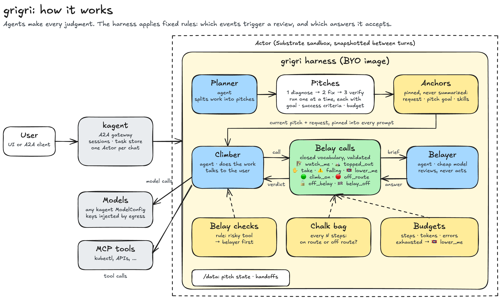

# grigri

[](LICENSE)
[](go.mod)
[-blue)](https://github.com/kagent-dev/kagent)


Long agent tasks drift, forget their instructions, and take risky steps without a second look. grigri is a lightweight Go **harness** for [kagent](https://github.com/kagent-dev/kagent) that adds a safety layer around the agents it runs: anchored context that is never summarized away, bounded pitches of work, and a belayer agent that reviews risky steps and catches drift.

Named after the climbing belay device. Not affiliated with or endorsed by Petzl.

## How grigri works



grigri runs as a kagent [BYO harness](https://github.com/kagent-dev/kagent): one image that kagent starts for each conversation. Agents are ordinary kagent `AgentTemplate`s, so prompts and models are configuration, not code. Every judgment ("is this step safe?", "is the work on track?") is made by an agent. The harness only applies fixed rules: which events trigger a review, and which answers it accepts.

| Term | What it is |
|---|---|
| **Climber** | Does the work and talks to the user |
| **Belayer** | Reviews steps and answers with a belay call; never acts. Bound to the climber as the subagent `belayer` |
| **Planner** | Splits a request into pitches |
| **Harness** | Fixed rules: when to check, what counts as a valid answer; never judges |
| **Belay call** | Closed set of messages between the agents and the harness |
| **Pitch** | Bounded unit of work: goal, success criteria, budget |
| **Anchor** | Context pinned into every prompt, never summarized |
| **Belay check / chalk bag** | Rule-triggered reviews: before risky tools / every N steps |
| **Budget** | Hard caps on steps, tokens and errors; running out ends the pitch |


### Belay calls

Agents in grigri talk through a small, closed set of **belay calls**. Each answer is JSON that the harness validates: the call must be an allowed answer to the request, and it must include a reason. Anything else counts as a refusal.

| | Call | Sent by | Means |
|---|---|---|---|
| 🧗 | **Watch me** (`watch_me`) | Climber | Risky step ahead, review it |
| 🟢 | **Climb on** (`climb_on`) | Belayer | Approved, carry on |
| 🔴 | **Off route** (`off_route`) | Belayer | Blocked, with a reason |

For example, asked to delete a production namespace, the climber calls `watch_me` before acting, and the belayer answers:

```json
{"call": "off_route", "reason": "Deleting the payments namespace and its volumes in prod causes irreversible data loss."}
```

The climber does not take the step and tells the user why.

## License

Apache 2.0. `cmd/kagent-harness` is adapted from kagent (Apache 2.0).
